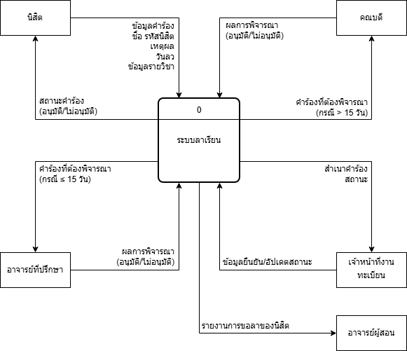

# University Leave Request System

System Analysis and Design project focusing on transforming a paper-based university leave request process into a structured information system.  
This project focuses on business process analysis and system workflow design using Data Flow Diagrams (DFD) and process descriptions.

---

## 📌 Project Overview
The Leave Request System is designed to manage and streamline the process of student leave requests within a university.  
The system supports leave submission, verification, approval, status updates, and notifications to all relevant stakeholders.

---

## 🎯 Scope of Work
- Analyze the university's leave request workflow
- Design Context Diagram (DFD Level 0)
- Design DFD Level 1
- Define system processes and data stores
- Design approval workflow (Advisor / Dean)
- Create UI prototype using Figma

---

## 🧩 External Entities
- Student
- Academic Advisor
- Dean
- Registrar Office
- Course Instructor

---

## 🗄 Data Stores
- Leave Request Form
- Student Information
- Advisor / Dean Information
- Course Information
- Leave History

---

## 🔄 Main Processes
1. Submit Leave Request  
2. Verify Leave Request Information  
3. Send Request to Academic Advisor (≤ 15 days)  
4. Send Request to Dean (> 15 days)  
5. Update Leave Request Status  
6. Notify Student and Related Parties  

---

## 📊 Data Flow Diagram

### Context Diagram

### DFD Level 1

---

## 🎨 Figma Prototype

### Context Diagram

---

## 🛠 Tools & Technologies
- Draw.io : DFD Diagrams
- Figma : UI Prototype

---

## 🎨 Document & Prototype
🔗 [Document](https://drive.google.com/file/d/1aOEi42I229do91ea7dBpCnvLFr3Qx7jV/view?usp=sharing)
🔗 [Prototype](https://www.figma.com/proto/cCVhHqnRHclli1pDbTlSM8/6630200373_15?node-id=1-6865&p=f&t=NfUXtsdyPO5Ehz2r-1&scaling=min-zoom&content-scaling=fixed&page-id=0%3A1&starting-point-node-id=1%3A6865&show-proto-sidebar=1)

---

## 📚 Course Information
System Analysis and Design  
Kasetsart University, Sriracha Campus

---

## ✅ Notes
This project is an academic system analysis project and does not contain real personal data.

